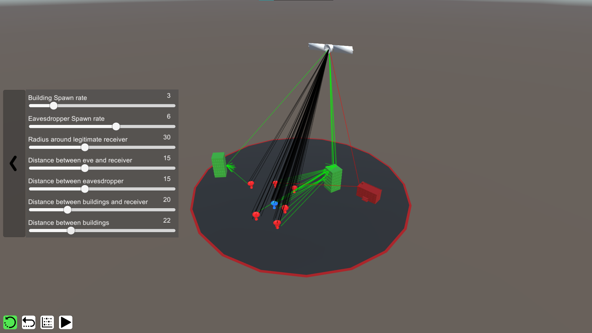
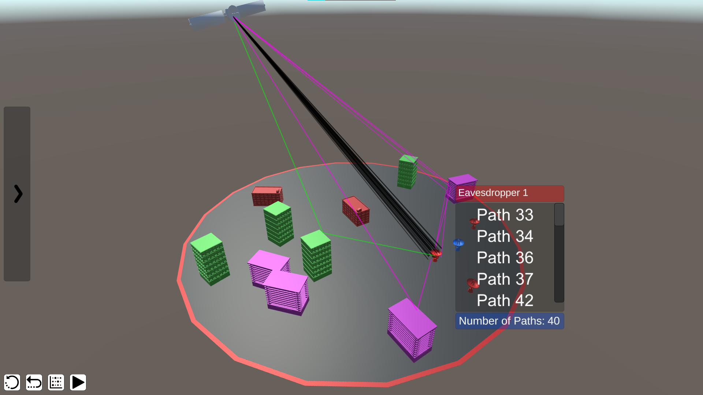
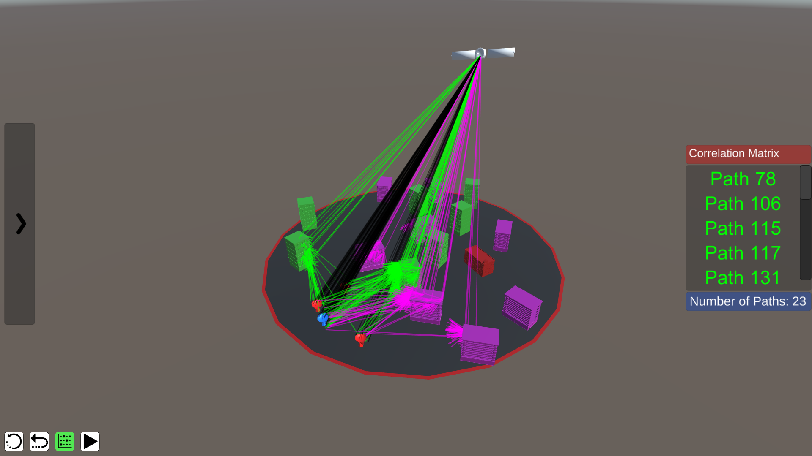

# SatelliteViz

## Overview
SatlliteViz is a simulation made with Unity to demonstrate physical layer security for mmWave satellite networks. This visualization was created as part of a research project, and illustrates the findings of Xiao Ke et al. in their paper ["Physical Layer Security in mmWave Satellite Networks"](https://ieeexplore.ieee.org/document/8422916)

## Content
SatelliteViz offers a settings menu to control and adapt the simulation enviroment. For example, one can increases the amount of buildings or eavesdropper. 

Furthermore, by clicking on a specific receiver on the ground, a list of all transmission paths will be shown and only those paths will be visualized. All other paths which do not hit the receiver will be removed.

As a final option for better analysis, the functionality of listing all paths that the eavesdropper and legitimate receiver have in common, also known as correlation matrix, will be shown.

The color coding of the transmission paths correspond to the different ways how rays propogate through the enviroment based on characteristics of light transmission. This means:
* black = direct rays
* red = reflected rays
* green = scattered rays
* magenta = diffracted rays